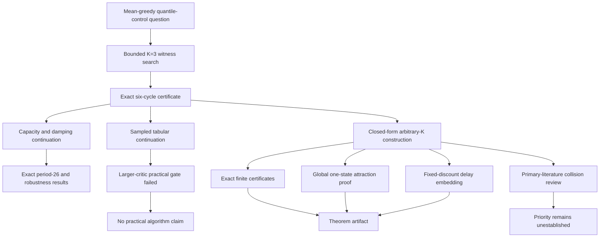

# Research handoff

## Current decision

Retain this as a self-contained theorem artifact, **not a new RL algorithm project**. The final result is the explicit arbitrary-K strict-cycle family in `THEOREM.md`. The earlier sampled-learning practical gate failed and remains failed. External peer review, theoretical priority, and practical relevance are unestablished.

The intended public home is https://github.com/mottopanikeiku/quantile-cycles, branch `main`, MIT license, sole author mottopanikeiku. This repository is independent of Yoked Plasticity; that project was not modified by this continuation.

## Claim ledger

| Claim | Status | Evidence and boundary |
|---|---|---|
| For each K>=2, a one-state two-action strict two-cycle exists | Analytic proof with finite exact corroboration | `THEOREM.md` Sections 2-4; `certify.py`; 18 checked capacities. MDP parameters depend on K. |
| Every finite one-state initial table converges modulo phase | Analytic proof; separately reviewed | Section 5: range bound, eventual permanent block separation, forced strict alternation, scalar contraction. Finite certificates do not enumerate all initial tables. |
| No fixed point exists for the constructed one-state operator | Consequence of global attraction | The only phase limits are two distinct tables. This is the hard projected control operator, not fixed-policy evaluation. |
| Any fixed 0<gamma<1 admits a finite-state example | Analytic delay embedding with exact checks | Section 7; five gamma=9/10 instances. Exactly L states, primitive period 2L, local attraction. No claim of one common global phase pattern across delay residues. |
| K=1 cannot have a nontrivial discounted value cycle | Contraction proof | Section 8; requires gamma<1. Does not imply risk-neutral optimality. |
| Original K=3 six-cycle and alpha=1/2 period-26 cycle | Exact rational certificates | `historical/`; distinct phases, strict greedy choices, exact closure. Different MDP from the current family. |
| Original six-cycle survives an open reward/probability neighborhood | Analytic local proof with exact inequalities | Historical continuation report and robustness certificate; fixed transition topology, discount and K. |
| Larger-critic practical instability on the original witness | Rejected by frozen gate | No sampled cell passed the K>=16 requirement. Do not promote the K=3-only effect into a different claim. |
| This is the first such theorem | Unestablished | `PRIOR_ART.md` distinguishes close precedents; targeted search absence is not a priority proof. |
| Sampled/deep QR-DQN generally fails or a new remedy is better | Not tested or claimed | No empirical extension of the new family has been run. Existing mean-preserving, scalar-control, and QEM ideas are not new proposals. |

## Reproduction and verification

On 2026-09-09, the following actual commands succeeded from the repository root:

```sh
python -B verify.py
.venv/bin/python -B verify.py --historical
```

The first used only the standard library and completed in 9.11 seconds on the development CPU. The second used an isolated environment with NumPy 2.3.5 and completed in 9.39 seconds. Times are observations, not performance guarantees.

The full result is saved in `results/verification.json`:

- 18 one-state exact instances and 18 six-update zero-start checks;
- five exact delay embeddings, with periods 28,36,54,66,80;
- original period six, damped period 26, and robustness inequalities reproduced;
- 32 stored output files hash-checked;
- 41 array members and three JSON files compared semantically across the two preserved runs;
- eight policy-value systems independently solved in rational arithmetic;
- all 12 sampled endpoint rows recomputed from policy traces.

The full verification checks previously executed training artifacts. It does **not** rerun the 20,000-update sampled-learning experiment. For that separate command, see `historical/README.md`.

There is no separate testing framework or benchmark abstraction. The exact checker programs are the executable behavioral checks. Do not invoke the preserved checkers with Python assertions disabled; the wrapper explicitly removes `PYTHONOPTIMIZE` from child environments.

## Research graph



These are dependency and decision edges, not evidence that a later theorem repairs the failed empirical gate.

## Completed bounded loops

### Initial mechanism loop

A bounded exact-backup search produced a three-state K=3 witness. Numerical recurrence was converted to an exact rational affine solution, then independently checked by the actual quantile backup and true policy-value equations. The evidence supports a local strict cycle, not global attraction for that original MDP.

### Practical falsification loop

The continuation protocol was frozen before its runs. It used 4,000 exact updates per capacity/damping setting and sampled learning with 16 seeds, 20,000 updates, paired transition draws, pinball/Huber losses, and two schedules. The primary endpoint was tail stationary-policy regret relative to scalar Q-learning.

The predeclared larger-critic gate failed. A deterministic reproduction and independent endpoint recalculation preserved that conclusion. No extra environments or post-hoc threshold changes were used to rescue it.

### General-construction loop

The later algebraic family separated reward blocks so that each midpoint quantile of the mixture selects the minimum continuation atom from a different reward block. That produces two affine branches with a strict alternating mean comparison. Closed-form orbit values, actual-policy losses, and phasewise contraction were derived before the finite rational certificates were executed.

The final proof normalized all rewards to [0,1], extended beta to the whole interval (0,1/(2K)], established global one-state attraction, and embedded the construction at any fixed primitive discount. These are analytic results, not sampled-learning observations.

### Independent challenge loop

Automated algebra review checked cycle closure, quantile uniqueness, reward/value gaps, local contraction, delay indexing, zero-start convergence, and the later global-attraction argument. Two initial scope clarifications were incorporated into the final note: K=1 needs gamma<1, and the logarithmic state bound requires the minimal qualifying delay.

A separate primary-source review found very close ingredients but no exact matching conjunction. The final literature comparison distinguishes uniformly bounded reward range from growing support cardinality. Neither automated review establishes external acceptance or priority.

## Artifact integrity and maintenance

- `construction.md` is a frozen initial derivation because its hash is bound into `results/certificates.json`. `THEOREM.md` is canonical and includes the later proof and review clarifications.
- The historical protocol, runner, witness, stored outputs and certificate inputs retain their bound bytes and relative layout. Historical reports are stage-specific records, not current claims.
- The current verifier compares complete parsed certificates; only runtime and Python-version metadata are ignored. Source hashes remain part of the comparison.
- NumPy is optional and needed only for historical training/artifact handling. Current exact arithmetic uses `fractions.Fraction`.
- Generated local runs, virtual environments and bytecode are ignored. No throwaway smoke-test script is required or shipped.
- If source changes intentionally, first determine whether it changes the mathematical contract. Regenerate and inspect the relevant certificates; do not silently weaken equality checks or overwrite the preserved historical protocol/results.

## Prerequisites for further work

No additional experiment is authorized by this handoff alone. Reasonable next research directions require their own scope and stopping rules:

1. **External mathematical/priority review:** give a specialist the final proof and exact distinction from Rowland 2019 and the book's tie-based examples. Do not claim “first” beforehand.
2. **Practical extension of the new family:** freeze an experiment before running it, separate hard projection from pinball/Huber SGD, account for the K-dependent reward law and shrinking probability offsets, and state the failure criterion. Do not reuse the old failed gate as if it passed.
3. **Algorithmic remedy:** first compare against existing mean-preserving projections, separate scalar control, and quantile-derived mean estimators. A new abstraction or controller is not justified by the theorem alone.

The completed deliverable is the construction, proof, executable certificates, literature boundary, and intact negative empirical record.
