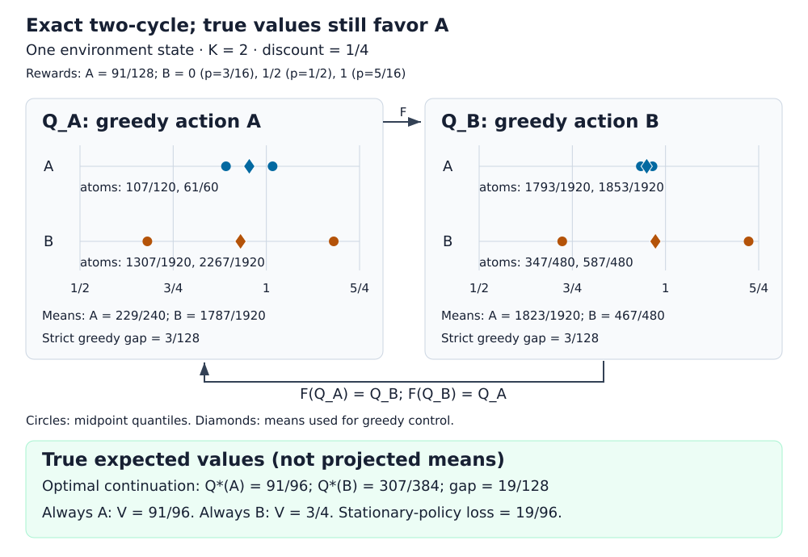

# Quantile Cycles

An exact counterexample to hard quantile-projected Bellman control, with a sampled test that separates this operator from quantile-Huber learning.

**Question:** can a mean-greedy quantile critic alternate forever between the optimal and a worse action—and does that failure survive standard Huber updates?

I constructed a one-state MDP with a strict two-cycle and no fixed point for the hard projected operator ([proof](THEOREM.md), [exact checker](certify.py)). I then ran population and paired sampled learning without changing the MDP after seeing the results ([code](sampled.py), [fixed protocol](docs/SAMPLED_PROTOCOL.md)).

**Result:** the exact cycle exists, but the pre-specified material Huber failure does not. I ran **32 seeds × 100,000 updates**, with **32 target pairs per action**. All four required Huber comparisons failed the stopping rule, so I did not run replay/network training ([complete results](results/sampled-summary.json)).

## The exact result



For **K=2**, discount **1/4**, A pays **91/128**. B pays **0, 1/2, 1** with probabilities **3/16, 1/2, 5/16**. Both projected greedy gaps are **3/128**, while A's true reward advantage is **19/128** and always B loses **19/96** in discounted value ([certificate](results/certificates.json)).

The [paper proof](THEOREM.md) constructs a corresponding MDP for every **K≥2**, with **0<β≤1/(2K)**. Every finite real initial table approaches its strict two-cycle modulo phase, including arbitrary transient tie choices; hence there is no fixed point. For a prescribed discount **0<γ<1**, a delay chain gives **L=ceil(log(2K)/(−log γ))** states and exact period **2L**, with local—not common-phase global—attraction. The [stored certificates](results/certificates.json) check periods **28, 36, 54, 66, 80** at γ=9/10.

The [separate Lean PR](https://github.com/mottopanikeiku/quantile-cycles/pull/2) checks the specific rational K=2 MDP, its generalized-inverse quantiles and strict two-cycle. It is checked by Lean's kernel with no sorry and no axioms beyond Lean's standard three (propext, Classical.choice, Quot.sound); [every axiom listing](https://github.com/mottopanikeiku/quantile-cycles/blob/night2-lean/results/lean-axioms.txt) is saved. The general real-valued attraction and no-fixed-point theorems are not formalized. This sampled branch contains Python checks, not the Lean project.

## What changed under learning

The table reports normalized final-window stationary-policy regret: the fraction of greedy choices that are B, averaged over seeds. Each pair is **constant / decaying** steps. These family rows use different K-dependent MDPs.

| Family K | Sampled pinball | Sampled Huber κ=1 | Paired scalar |
|---:|---:|---:|---:|
| 2 | 0.37519 / 0.39939 | 0 / 0 | 0 / 0 |
| 8 | 0.07916 / 0.11637 | 0 / 0 | 0 / 0 |
| 32 | 0.10325 / 0.02846 | 0.00429 / 0 | 0.07826 / 0.00229 |

Source: [all cells, seeds and intervals](results/sampled-summary.json); [raw checkpoints](results/sampled-raw.json.gz). Population Huber has zero final-window regret in every setting. At K=32 with constant steps, sampled Huber's paired normalized excess is **−0.07396**, with **95% CI [−0.07662, −0.07127]**. It is better than this scalar baseline, not a practical failure.

I also held the K=2 MDP fixed while increasing critic capacity to 8 and 32: all sampled losses had zero observed final-window regret. [The full report](docs/SAMPLED_RESULTS.md) includes damped hard backups, absolute regret, switching rates and the shrinking CDF margins. Noisy switches do not certify a periodic orbit.

## Reproduce

For the full study, use Python 3.11 and a Modal account:

```sh
python -m pip install -r requirements-sampled.txt modal
python -B verify.py && modal run modal_sampled.py --stage population --output results/population.json.gz && modal run modal_sampled.py --stage sampled --output results/sampled-raw.json.gz
python -B tools/summarize_sampled.py
```

The exact verifier alone needs only Python's standard library. The study used CPU-only containers with **2 cores and 1 GiB each**, at most **four** containers; the pilots and full runs have a cost upper bound of about **$0.022** ([compute record](results/sampled-compute.json)). CI checks exact certificates, the generated figure, loss gradients, sample pairing, endpoint accounting and the committed seed-bootstrap analysis; it does not repeat full training.

## Limits

- The family changes with K; it is not one MDP failing at every capacity.
- Hard quantile projection, pinball SGD and Huber SGD are different operators.
- Finite runs do not prove asymptotic convergence or nonconvergence; zero seed-bootstrap intervals do not exclude rare unseen seeds.
- This generative-sampler tabular study has no exploration, replay, target networks or meaningful generalization test.
- The general theorem is not Lean-checked or externally peer-reviewed. Earlier sampled work on a different witness remains [negative](historical/README.md); priority is unestablished.

## Prior work

I build on [Dabney et al.'s quantile projection and Huber loss](https://arxiv.org/abs/1710.10044), [Rowland et al.'s finite-quantile suboptimality examples](https://proceedings.mlr.press/v97/rowland19a.html), and [distributional control nonconvergence examples](https://www.distributional-rl.org/contents/chapter7). [PRIOR_ART.md](PRIOR_ART.md) distinguishes this construction from those results; [NEXT.md](docs/NEXT.md) retains the general formalization plan.

Written with AI coding assistance.
